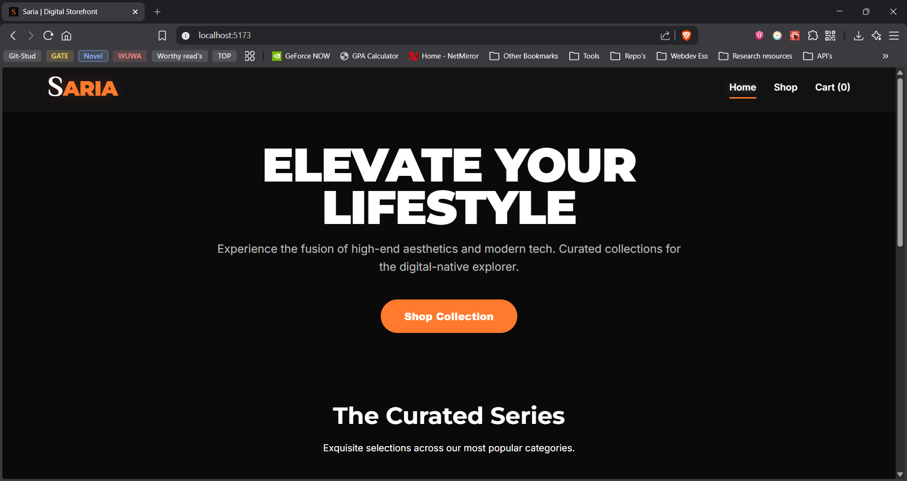

# Saria - Digital Storefront



Saria is a modern, responsive e-commerce web application built with React. It features a premium dark-themed "glassmorphism" aesthetic, dynamic product fetching, and a fully functional state-driven shopping cart. 

## ✨ Features

* **Premium UI/UX:** A sleek, dark-themed interface utilizing glassmorphism, custom CSS variables, and fluid typography (Inter, Montserrat, and El Messiri).
* **Dynamic Product Catalog:** Fetches and displays real-time product data and categories using the [DummyJSON API](https://dummyjson.com/).
* **Advanced Sorting & Filtering:** Users can filter products by category and sort by price (Low to High / High to Low) or Top Rated.
* **Stateful Shopping Cart:** Built with React Context API. Features include adding items, updating quantities, removing items, clearing the cart, and real-time subtotal/tax/total calculations.
* **Fully Responsive:** Optimized for desktops, tablets, and mobile devices with fluid CSS Grids and Flexbox layouts.

## 🛠️ Tech Stack

* **Frontend Framework:** React.js
* **Routing:** React Router v6
* **State Management:** React Context API (`CartContext`)
* **Styling:** Pure CSS3 (Custom Properties, Flexbox, Grid, Media Queries)
* **Data Source:** DummyJSON API

## 🚀 Getting Started

Follow these instructions to get a copy of the project up and running on your local machine.

### Prerequisites

* Node.js installed on your machine.
* npm or yarn package manager.

### Installation

1.  Clone the repository:
    ```bash
    git clone [https://github.com/Faizulmd13/Saria.git](https://github.com/Faizulmd13/Saria.git)
    ```
2.  Navigate into the project directory:
    ```bash
    cd Saria
    ```
3.  Install the dependencies:
    ```bash
    npm install
    ```
4.  Start the development server:
    ```bash
    npm run dev
    # or npm start depending on your bundler
    ```
5.  Open your browser and visit `http://localhost:5173` (or the port specified in your terminal).

## 📂 Project Structure

```text
src/
├── components/
│   ├── cart/         # CartItem, Invoice
│   ├── common/       # Header, Footer
│   └── shop/         # ProductCard, SideBar
├── context/
│   └── CartContext.jsx # Global cart state
├── hooks/
│   └── useProducts.js  # Custom hook for API fetching
├── pages/
│   ├── Home.jsx
│   ├── Shop.jsx
│   └── Cart.jsx
├── styles/           # Modular CSS files for components
├── utils/
│   └── categoryMapping.js
├── App.jsx
└── index.css         # Global styles and CSS variables